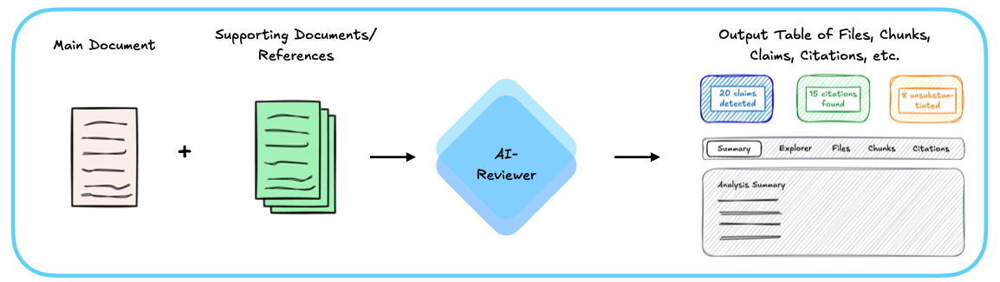
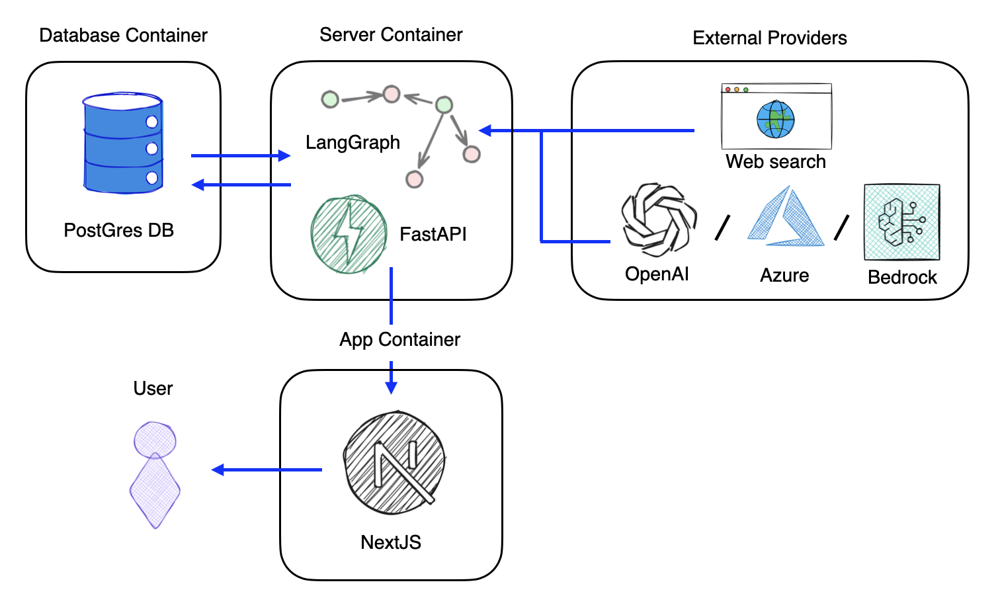
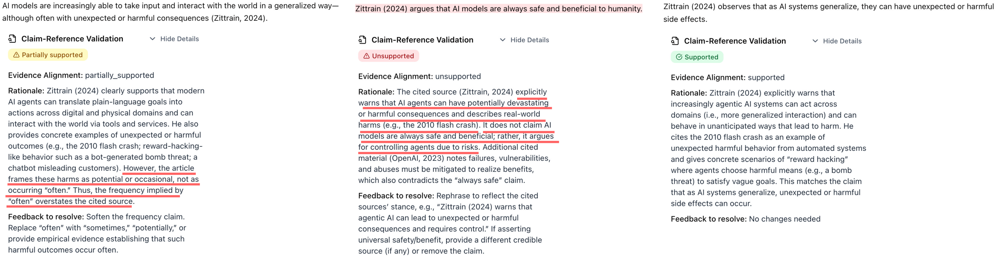

AI Reviewer is an automated document analysis system designed to assist in academic peer review by systematically evaluating the relationship between claims and their supporting evidence in research documents. The project goal is to employ most recent LLMs, agent-based workflows and techniques found the most recent literature to help researchers, reviewers, and academics improve the rigor and quality of their work.

This project is funded by [RAND](https://rand.org/)'s [CAST center](https://www.rand.org/global-and-emerging-risks/centers/ai-security-and-technology.html) (RAND Center on AI, Security, and Technology).

## Introduction

Automated scholarly paper review (ASPR) represents an emerging field that leverages artificial intelligence and natural language processing to assist in the peer review process. As the volume of academic publications continues to grow exponentially, traditional manual review processes face increasing challenges in scalability, consistency, and timeliness [^1]. ASPR systems aim to augment human reviewers by automating various aspects of document evaluation, including claim verification, citation analysis, and evidence assessment.

Recent surveys on LLMs for ASPR [^2] indicate that large language models have shown transformative potential for the full-scale implementation of automated review systems. LLMs are being widely adopted across the academic review process, demonstrating significant improvements in review efficiency, generating high-quality structured comments, validating checklists, and checking technical errors. The incorporation of LLMs has enabled new capabilities such as long text modeling, multi-modal input processing, and advanced prompt engineering techniques that address many of the technological bottlenecks that previously limited ASPR systems. However, this integration also introduces new challenges, including concerns about bias, inaccuracies, privacy risks, and the need for transparent disclosure of AI usage in the review process.

[^1]: Lin, J., Song, J., Zhou, Z., Chen, Y., & Shi, X. (2023). Automated Scholarly Paper Review: Concepts, Technologies, and Challenges. arXiv preprint arXiv:2111.07533. https://arxiv.org/pdf/2111.07533
[^2]: Zhuang, Z., Chen, J., Xu, H., Jiang, Y., & Lin, J. (2025). Large language models for automated scholarly paper review: A survey. arXiv preprint arXiv:2501.10326. https://arxiv.org/html/2501.10326v1

This project focuses on providing an end-to-end, ready-to-use open source tool that leverages commercial large language models (LLMs) and various methods found in the most recent literature and state-of-the-art research. The system addresses critical aspects of scholarly document quality through the systematic evaluation of claim-evidence relationships: ensuring that claims are properly substantiated by their cited references, identifying gaps in evidentiary support, and recommending improvements to strengthen the document's foundation.

## Objectives

The system addresses these primary research questions:

1. **Claim-Reference Alignment**: Does each cited reference provide evidence that substantiates the associated claim?
2. **References Validation**: Are the references correct, including Author, Title, Year and Publisher fields that have online presence?
3. **Missing Substantiation**: Which claims require citation but lack appropriate references?
4. **Citation Recommendations**: What additional references could strengthen the document's evidentiary foundation?
5. **Literature Review**: Is there any other related published work that could be referenced to strengthen or counter the arguments presented?
6. **Live Reports** (for past published documents): Is there any newer related work that supports, strengthens, contradicts, or brings newer information that should be considered to expand the document's arguments?

## Methodology

### Document Processing Pipeline

The system accepts two primary inputs: a **main document** to be reviewed and a set of **supporting documents/references** that provide the evidentiary foundation. These inputs are processed by the AI-Reviewer, which orchestrates a series of specialized agents to analyze the document. The output is a comprehensive table containing all extracted elements—files, chunks, claims, citations, and their verification results—along with a detailed analysis summary. The web interface provides multiple views (Summary, Explorer, Files, Chunks, Citations) to navigate the results and assess the quality of claim substantiation throughout the document.

The system processes documents through a multi-stage pipeline implemented using LangGraph, which orchestrates a series of specialized AI agents:

1. **Document Conversion**: Input documents (PDF, DOCX, Markdown) are converted to structured markdown format while preserving semantic structure.

2. **Document Chunking**: Documents are segmented into semantically coherent chunks using recursive character text splitting. Chunks maintain paragraph boundaries and are sized to preserve context while enabling granular analysis.

3. **Claim Extraction**: An LLM-based agent extracts factual claims from each chunk. Claims are defined as decontextualized propositions—assertions that can be understood and verified independently of their surrounding context. The extraction process considers:

   - Full document context
   - Paragraph-level context
   - Domain-specific knowledge requirements
   - Target audience expectations

4. **Citation Detection**: Citations are identified and mapped to their corresponding references in the document's bibliography. The system handles various citation formats and associates citations with claims based on proximity and paragraph-level context.

5. **Reference Extraction**: Bibliographic references are extracted and structured, enabling mapping between in-text citations and their full reference entries.

6. **Claim Categorization**: Extracted claims are classified into six categories:

   - Established/reported knowledge
   - Methodological/procedural statements
   - Empirical/analytical results
   - Inferential/interpretive claims
   - Meta/structural/evaluative statements
   - Other

   Each category determination includes an assessment of whether external verification is required, filtering out common knowledge claims that do not necessitate citation.

7. **Claim Verification**: Claims are verified against supporting documents using RAG-Based verification:

   - Supporting documents are indexed in a vector store using OpenAI's `text-embedding-3-large` embeddings
   - Documents are chunked (2000 characters with 400-character overlap) and embedded
   - For each claim, an enriched query is constructed combining the claim text, chunk context, and relevant backing information
   - Semantic similarity search retrieves the top-k most relevant passages from all supporting documents
   - Retrieved passages are ranked by cosine distance and presented to the verification agent
   - The LLM evaluates whether retrieved passages substantiate the claim

8. **Inference Validation**: Claims identified as inferential or interpretive are analyzed to detect potential logical fallacies, unsupported leaps, or missing intermediate reasoning steps.

9. **Literature Review**: The system conducts automated literature reviews by:

   - Searching external sources for supporting or conflicting evidence
   - Identifying newer publications relevant to the claims
   - Evaluating reference quality and source credibility
   - Recommending citation additions, replacements, or discussions

10. **Citation Suggestion**: For claims lacking citations, the system suggests relevant references from the document's bibliography or external sources, considering:
    - Relevance to the claim
    - Source quality and credibility
    - Publication recency
    - Domain appropriateness

### Technical Architecture

**Agent-Based Design**: The system employs a registry-based agent architecture where specialized agents handle distinct tasks:

- Claim extraction agent
- Citation detection agent
- Claim categorization agent
- Claim verification agent (with citation-based and RAG-based variants)
- Reference extraction agent
- Literature review agent
- Citation suggestion agent
- Evidence weighting agent

Each agent implements a common protocol, enabling dynamic composition and replacement of components.

**Workflow Orchestration**: LangGraph manages the execution flow, supporting:

- Conditional node execution based on configuration
- Parallel processing of independent operations
- State persistence and checkpointing for resumable workflows
- Error handling and graceful degradation

**Vector Storage**: Supporting documents are indexed in PostgreSQL with pgvector extension:

- Each document maintains its own collection for efficient retrieval
- Embeddings are generated using OpenAI's text-embedding-3-large model
- Similarity search uses cosine distance metric
- Collections are cached and reused across workflow runs

**State Management**: The workflow maintains a comprehensive state object (`ClaimSubstantiatorState`) that tracks:

- Original documents and their markdown representations
- Extracted chunks with associated metadata
- Claims, citations, and references per chunk
- Verification results and evidence alignments
- Error conditions and recovery information
- Configuration parameters

### LLM Configuration

The system uses GPT-5 (via LangChain) for all agent operations, configured with:

- Temperature: 0.0-0.5 (depending on task determinism requirements)
- Structured output enforcement via Pydantic models
- Timeout handling for reliability
- Langfuse integration for observability and tracing
- The LLM provider can be easily changed between OpenAI's GPT, Azure's GPT and even other providers (Anthropic, Gemini etc)

### Evaluation Framework

The system includes evaluation capabilities for:

- Claim extraction accuracy
- Citation detection precision and recall
- Verification alignment classification
- End-to-end workflow performance

Evaluation datasets are maintained in YAML format with ground truth annotations for systematic testing.

### System architecture

The system follows a containerized architecture consisting of three primary containers and integration with external providers. The **App Container** hosts a NextJS frontend that provides the user interface, allowing users to interact with the system. This frontend communicates with the **Server Container**, which houses the core processing engine built on FastAPI and LangGraph. LangGraph orchestrates the agent-based workflow as a directed graph, where each node represents a specialized processing step (claim extraction, verification, citation detection, etc.). The **Database Container** runs PostgreSQL with the pgvector extension, storing workflow state, execution history, and vector embeddings for semantic search. The server container maintains bidirectional communication with the database for both workflow persistence and retrieval-augmented generation (RAG) operations. Finally, the system integrates with **External Providers** including OpenAI, Azure, Bedrock (or others) for large language model inference, as well as web search capabilities for literature review tasks. This architecture enables flexible deployment, horizontal scaling of processing components, and provider-agnostic LLM integration through a unified interface.

## Results

### Claim-Reference Alignment

The example below demonstrates the system's capability to assess claim-evidence alignment across different levels of substantiation. Three variations of a sentence extracted from a research document are evaluated: (1) the original sentence, classified as "partially supported" due to a minor overstatement in its claims; (2) a modified version containing explicit contradictions with the cited evidence, correctly identified as "unsupported"; and (3) a refined version with softened language that aligns more precisely with the evidence, classified as "supported". This illustrates the system's sensitivity to subtle variations in claim strength and its ability to distinguish between different degrees of evidentiary support.

### References Validation

TODO: show screenshot of examples of results

### Missing Substantiation

TODO: show screenshot of examples of results

### Citation Recommendations

TODO: show screenshot of examples of results

### Literature Review

TODO: show screenshot of examples of results

### Live Reports

TODO: show screenshot of examples of results

## Limitations and Considerations

1. **LLM Dependencies**: Verification quality depends on the underlying LLM's reasoning capabilities and may exhibit biases or errors inherent to the model.

2. **Reference Availability**: Citation-based verification requires access to full-text versions of cited references. When unavailable, the system marks claims as unverifiable.

3. **Semantic Retrieval**: RAG-based verification relies on semantic similarity, which may retrieve passages that are topically related but do not substantiate specific claims. The verification agent filters these, but false positives are possible.

4. **Common Knowledge Boundaries**: The distinction between claims requiring citation and common knowledge is domain- and audience-dependent. The system's categorization may not align with all disciplinary conventions.

5. **Citation Proximity**: The system associates citations with claims based on paragraph-level proximity. In cases where citations are distant from their claims, associations may be incorrect.

6. **Processing Scale**: Large documents with many claims require significant computational resources. The system supports selective re-evaluation of specific chunks to optimize resource usage.

---

_This documentation describes the system's scientific and technical approach. For development setup and usage instructions, see the README and DEVELOPMENT files in the [GitHub repository](https://github.com/agencyenterprise/ai-reviewer)._
